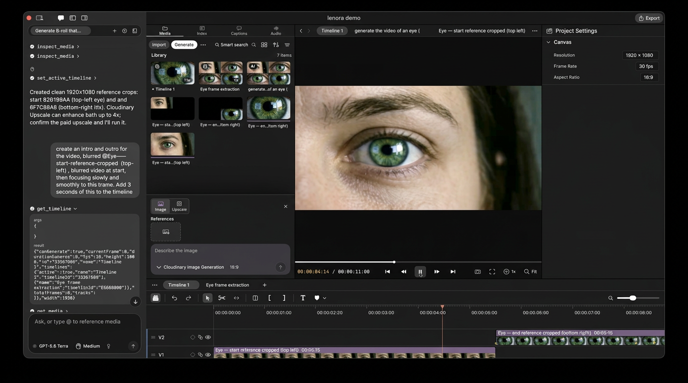

# Lenora for Cloudinary

**Track 3 — Your Media-Savvy Startup.** Lenora is a Mac video editor you could ship as a product: the timeline is the product, and Cloudinary is the media system behind every shot that is generated, changed, tagged, or published.

[](https://github.com/vermatushar/Lenora/blob/main/assets/this-is-lenora.mp4)

The product README is [README.md](README.md). Adapter settings, models, and limits are in [backend/adapters/cloudinary/README.md](backend/adapters/cloudinary/README.md).

## The problem

A creator's work is the media. Today's AI tools sit beside the edit: they return a file, and the person still has to import it, place it, and keep track of what it is. A startup in this space has to own that path. Upload, transform, understand, and deliver have to happen on the same asset the editor is already cutting.

Lenora is that product. You edit by hand, or you ask the in-app agent (or Claude Code, Cursor, Codex, or Claude Desktop over MCP) to cut, caption, generate, and publish. Every agent change is an ordinary undo step. Playback, transcription, and on-device search stay on the Mac. Anything that creates or transforms a picture or a video goes through Cloudinary.

## How Lenora uses Cloudinary

Cloudinary is the only system that stores, transforms, and delivers the media the editor generates. The Mac app holds no Cloudinary keys. It talks to a small self-hosted backend, which uploads with a signed ticket and gets back a signed delivery URL. Strict transformations can stay on.

| What the user does | What Cloudinary does |
|---|---|
| Remove a background, fill, replace, recolor, restore, or upscale a still | Upload API, then a signed transformation URL |
| Reframe a video so the subject stays in frame | `g_auto` fill, on the fly or `eager_async` for larger files |
| Generate a still, or turn a still into video | Image Generation and Image to Video add-ons |
| Ask the agent to tag, caption, or inspect a frame | Analyze API (Google tagging, AI Vision, object detection, and the other add-ons on the account). Tags are written onto that asset; no new file is created |
| Enhance or smart-crop a still | Viesus Correct, Imagga Crop, as signed delivery URLs |
| Publish an export | One upload, then HLS, a poster, a download, an optional vertical cut, and a 5–30 s teaser, as signed unlisted links |

Subscribed add-ons are read from the account usage report, so Settings → Backend lists what this Cloudinary account can actually run, with quota used. Analysis models that need a prompt, tag definitions, or questions say so, and the agent passes them.

Publishing is the delivery half of the product. One finished export becomes a watchable link: a stream, a poster, a file, a vertical cut for social, and a teaser. Deleting the publication destroys the asset and its derived files and clears the CDN cache.

## How to test it

You need macOS 26 on Apple silicon, Xcode 26, [uv](https://docs.astral.sh/uv/), and a Cloudinary account. Image generation and image-to-video need those add-ons. Tagging, captioning, enhancement, and smart crop appear only for add-ons the account has subscribed to.

```bash
git clone https://github.com/vermatushar/Lenora.git
cd Lenora
./scripts/bootstrap
```

Put the Cloudinary credentials in `.env` and restart:

```bash
LENORA_CLOUDINARY_CLOUD_NAME=...
LENORA_CLOUDINARY_API_KEY=...
LENORA_CLOUDINARY_API_SECRET=...
./scripts/dev
```

`dev` starts the backend on `http://127.0.0.1:8787` and opens the app already connected to it. The app does not receive the Cloudinary secret.

**In the app**

1. Settings → Backend → Test Connection. The Cloudinary adapter should be enabled, with a row for each subscribed add-on and how much of its quota is used.
2. Import an image. Ask the agent to tag it. It calls `analyze_media` (Google Auto Tagging when the account has it) and the tags show up on that same asset in the library. Models that need a prompt, tags, or questions are listed by `list_models` with `type` `analyze`.
3. On an image, try Remove Background, a generative edit, or Upscale. On a short video, try Reframe. Each one uploads to Cloudinary and imports the delivered result next to the original. The finished import is one undo step.
4. Export a short timeline, then publish it. The publication returns when the stream, poster, and any vertical cut or teaser are ready. The links are signed and unlisted.

**Without the app**

From `backend/`, the Cloudinary suite runs against a mocked Cloudinary API and does not spend credits:

```bash
uv run pytest adapters/cloudinary/tests -m 'not live'
```

Live tests call the account and cost credits. They run only when `LENORA_CLOUDINARY_API_SECRET` is set:

```bash
uv run pytest adapters/cloudinary/tests -m live
```
