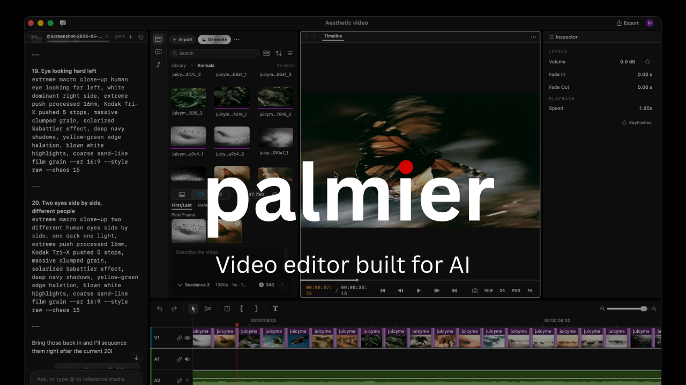

# Lenora

Open-source, agent-native video editor for the Mac. Edit by hand, or let Claude Code, Cursor or Codex drive the timeline over MCP. AI features run through a provider-neutral backend; Cloudinary is the first adapter.



## Requirements
- macOS 26 on Apple Silicon
- Xcode 26 with the Metal toolchain
- [uv](https://docs.astral.sh/uv/) (bootstrap offers to install it)

## Get started
```bash
git clone https://github.com/vermatushar/lenora.git
cd lenora
./scripts/bootstrap
./scripts/dev
```
No accounts or keys are needed to edit. To turn on AI features, add your Cloudinary keys to `.env` and restart `./scripts/dev`. `bootstrap` creates `.env` from [`.env.example`](.env.example), which documents every variable; `backend/README.md` covers running and deploying the backend on its own.

## Test
```bash
cd backend && uv run pytest
cd app && swift build && swift test
```
See `CONTRIBUTING.md` for the full set of checks.

## Connect an agent
Open **Settings → Agent → Connect an agent** and copy the snippet for Claude Code, Cursor, Codex or Claude Desktop.

## Repository
| Path | What | Licence |
|---|---|---|
| `app/` | The Swift editor, MCP server and in-app agent | GPLv3 |
| `backend/` | `lenora-backend` and its adapters | Apache-2.0 |
| `protocol/` | Lenora Backend Protocol v1 | Apache-2.0 |
| `skills/` | Bundled agent skills | Apache-2.0 |

## Credits
Lenora is built from the GPLv3 source of Palmier Pro (`last-gpl-source`, 8805801). See `NOTICE`. <!-- rebrand:allow -->
